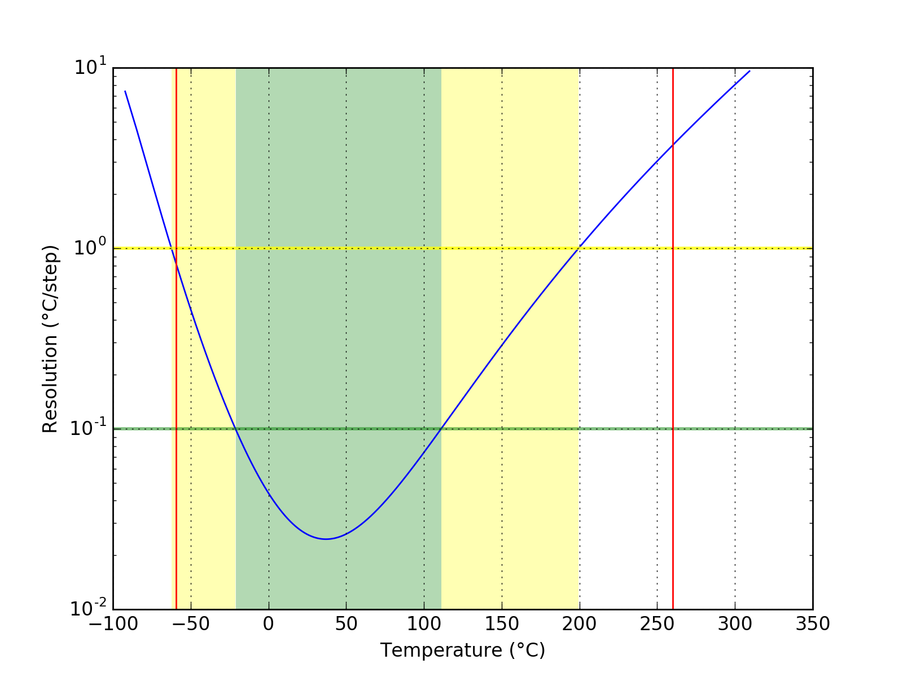
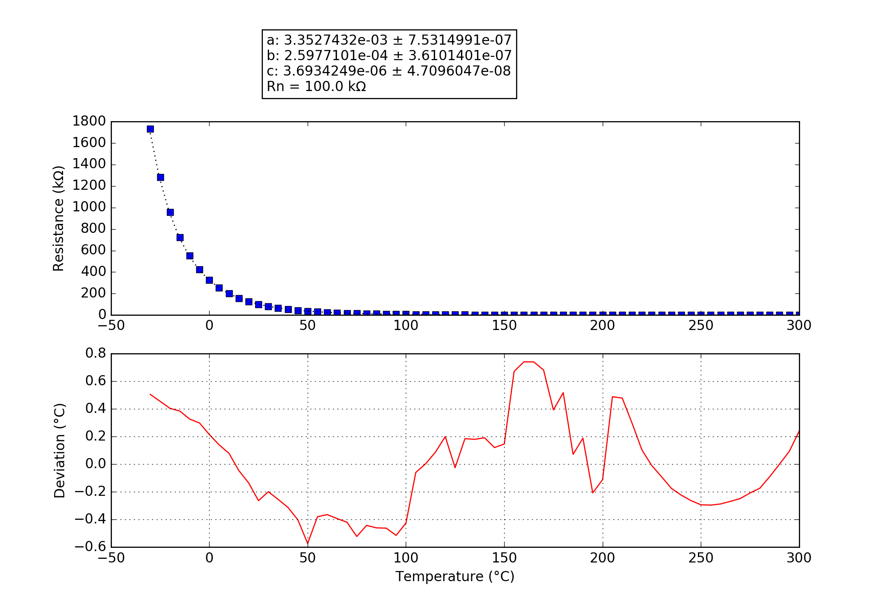

## 100K3950
### Probe performance data

Values based on 47k measurement resistor.

Property | Symbol | Value
-------- | -------- | --------
Resistance at 0°C | R25 | 323.73k
Resistance at 25°C | R25 | 101.15k
Resistance at 85°C | R25 | 10.82k
Beta 25°C to 85°C | B25/85| 3978K
Minimum measurable temperature | | 250.1°C
Minimum high-res temperature | | 111.1°C
Highest resolution || 2.45e-02°C/step at 37.0°C
Maximum high-res temperature | | -21.1°C
Maximum measurable temperature | | -56.3°C

### Probe curve data

Property | Symbol | Value
-------- | -------- | --------
Resistance near 25°C | R251 | 100.00k
Steinhart-Hart coefficient | a | 3.3527432e-03 ± 7.5314991e-07
Steinhart-Hart coefficient | b | 2.5977101e-04 ± 3.6101401e-07
Steinhart-Hart coefficient | c | 3.6934249e-06 ± 4.7096047e-08

1: The deviation between this R25 and the R25 shown above is not relevant, this R25 is taken from the original data point which is closest to 25°C. The value taken as a factor into the calculation of the final value and serves only a scaling purpose to the Steinhart-Hart coefficients.
